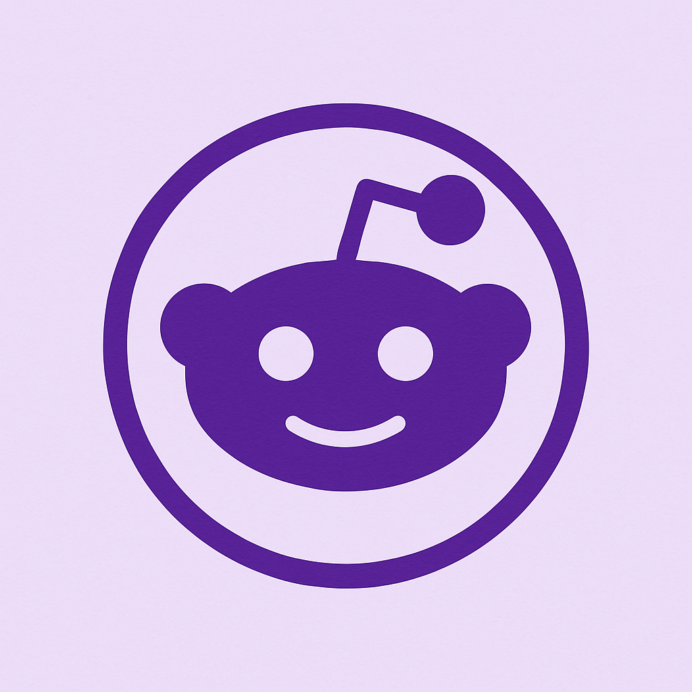

# 🎥 Redroll - The Next-Gen Reddit Experience

 

## 🌟 Overview
Redroll revolutionizes Reddit browsing with a **TikTok-inspired interface** that prioritizes seamless media consumption. Our carefully crafted dark theme with elegant purple accents creates an immersive experience that keeps you engaged for hours.

## ✨ Key Features

### 🎮 Intuitive Interaction
- **Fluid Vertical Scrolling**: Natural swipe-based navigation
- **Smart Media Detection**: Auto-plays videos as you scroll
- **One-Tap Controls**: Pause videos or expand descriptions instantly

### 🎨 Premium Design
- **Custom Dark Theme**: Eye-friendly interface
- **Purple Accent System**: Distinctive visual identity
- **Responsive Layout**: Perfect on any device

### ⚡ Performance Optimized
- **Progressive Loading**: Media loads as you scroll
- **Instant Search**: Find subreddits in milliseconds
- **Efficient Caching**: Smooth repeat viewing

### 🔒 Safety First
- **Content Filtering**: Automatic NSFW protection
- **Secure Rendering**: Protected against malicious content
- **Privacy Focused**: No tracking or data collection

## 🛠 Tech Stack

| Category        | Technology                          |
|-----------------|-------------------------------------|
| Framework       | Vue.js 3 (Composition API)          |
| Styling         | Bootstrap 5 + Custom SCSS           |
| Icons           | Bootstrap Icons                     |
| Markdown        | Marked.js + DOMPurify               |
| API Integration | Reddit JSON API                     |
| Animations      | GSAP + Custom CSS Transitions       |

## 🚀 Getting Started

### Quick Start
1. Clone the repository: `git clone https://github.com/NacreousDawn596/redroll.git`
2. Navigate to project directory
3. Open `index.html` in your preferred browser

### Advanced Setup
For developers looking to extend the project:
- Install live server for development
- Customize the subreddit list in the configuration
- Modify theme colors in the SCSS variables

## 🕹 User Guide

### Basic Navigation
- **Scroll**: Swipe up/down to browse
- **Tap**: Videos to pause/play
- **Click**: Descriptions to expand

### Advanced Features
- **Long Press**: Save favorite posts (coming soon)
- **Swipe Left**: View comments (in development)
- **Shake**: Refresh feed (mobile only)

## 📈 Roadmap
- [x] Core scrolling functionality
- [x] Media player integration
- [ ] Comments overlay 
- [ ] User profiles 
- [ ] Cross-platform app 

## 🤝 Contributing
We welcome contributions! Please:
1. Fork the repository
2. Create a feature branch
3. Submit a pull request

## 📜 License
MIT Licensed - Open source and free forever

---

**Ready to transform your Reddit experience?**  
[Try Redroll Now](https://nacreousdawn596.github.io/Redroll)  
Join thousands enjoying a fresh way to browse Reddit!

*Not affiliated with Reddit Inc. All content sourced from public Reddit API.*
